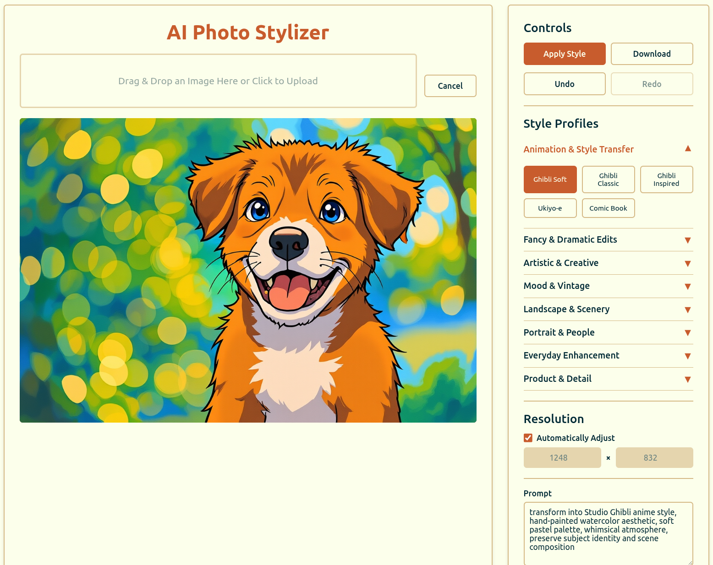

# GPT-4o Ghibli At Home: Your Private & Local AI Photo Stylizer

**Welcome to 4o-ghibli-at-home! Your own local and private, high-performance AI photo stylizer, powered by an enhanced `FLUX.1-Kontext-dev` and `DFloat11` model pipeline.**

This is not just a Ghibli-fier! The app has dozens of style profiles and advanced controls, you can transform your photos into everything from oil paintings and comic book art to cyberpunk cityscapes and vintage film stills. **Save your own custom styles, tweak the defaults, and use the app with _no login required_. Your images stay on your machine, always.**



## Major Features

- **Advanced Frontend**: A sophisticated, single-page application with:
  - Dozens of built-in **Style Profiles** organized by category (e.g., Animation, Artistic, Vintage).
  - **Custom Profile Management**: Save, load, and delete your own favorite settings.
  - **Undo/Redo** history for iterative editing.
  - Advanced controls for prompts, inference steps, guidance scales, and seeds.
- **Enhanced Model Pipeline**: Utilizes `black-forest-labs/FLUX.1-Kontext-dev` augmented with `DFloat11` for high-quality, efficient image generation.
- **Efficient VRAM Usage**: Run the full, lossless model on consumer hardware. By using a `DFloat11` quantization algorithm, **we cut VRAM requirements by ~30% without sacrificing quality**. This makes the model possible to run with high-end **consumer GPUs** like the RTX 3090 and 4090.
- **Environment-based Configuration**: Easily manage settings like queue size, file storage, and device selection using a `.env` file.
- **Persistent Storage & Cleanup**: Generated images are saved to disk, with an automatic background worker to clean up old job data and files to save space.
- **Intelligent Logging**: Uses `Loguru` for clean, readable logs and automatically filters out noisy status checks to keep the console tidy.
- **Simplified Architecture**: No external dependencies like Redis or Celery. Just Python and the required ML libraries.
- **Asynchronous Task Queue**: Uses a simple, thread-safe, in-memory queue to handle image generation jobs one by one, preventing server overload.

## Coming Up: Project Roadmap

Here's a look at the features and improvements planned for the near future:

**High Priority:**

- **Expanded Model Support:**
  - **GGUF & Advanced Quantization:** Introduce support for GGUF model formats and automatically select the best quantization level based on detected hardware. This will significantly lower VRAM requirements and broaden hardware compatibility.
- **`uv` Project Integration:** Fully transition the project to use `uv` for dependency and environment management, leveraging its speed.

**Core Enhancements:**

- **More Styling Profiles:** Add a new wave of creative and visual style presets to the frontend.
- **Windows Support:** Official installation and setup instructions for Windows users.
- **Dockerization:** Provide a `Dockerfile` for easy, one-command deployment in a containerized environment.

## Quick Start

### Requirements

**At this time, installation is supported exclusively on Linux.**

- **Python 3.11+**
  - `uv` or `pip` (Python package installer; `uv` is recommended for speed)
- **NVIDIA GPU**
  - **~21GB VRAM** is needed for the current implementation, which uses `DFloat11` quantization.
  - Support for additional quantizations and CPU offloading will be available soon.
- Modern web browser (Chrome, Firefox, Edge, etc.)
- Some images to Ghiblify!

## Setup & Installation

I recommend using `uv`. If you don't have `uv`, install it with `curl -LsSf https://astral.sh/uv/install.sh | sh`. You may need to restart your terminal.

### 1. Clone the Project

```bash
git clone https://github.com/TheAhmadOsman/4o-ghibli-at-home.git
cd 4o-ghibli-at-home
```

### 2. Create and Activate a Python Virtual Environment

A virtual environment is crucial for isolating project dependencies.

```bash
# Using uv (Recommended)
uv venv .vemv --python 3.11

# Or using Python's built-in venv
python3.11 -m venv .venv
```

After creating the environment, activate it:

```bash
# Activate
source .venv/bin/activate
```

### 3. Install Dependencies

Install the Python dependencies from `requirements.txt` into your activated environment.

```bash
# Using uv (Recommended)
uv pip install -r requirements.txt

# Using Python's built-in pip
pip install --upgrade pip
pip install -r requirements.txt
```

### 4. Configure Your Environment

The application is configured using an environment file.

1. Rename `.env_template` to `.env` in the project's root directory.
2. Edit the contents of your new `.env` file and adjust the values as needed.

**Notice:** If you haven't already logged in using `huggingface-cli login`, you must set `HUGGING_FACE_HUB_TOKEN` in your `.env` file with a token generated in your Hugging Face account settings. This is required to download gated models from Hugging Face.

## How to Run

The application runs with a single command, which starts the web server and the background processing worker. **I usually run local sessions with the development command.**

- **For Development (Recommended & Tested):**

    ```bash
    python3.11 app.py
    ```

- **For Production:**

    Use a production-grade WSGI server like Gunicorn. **It is critical to use only ONE worker** because the job queue is in-memory and cannot be shared across multiple processes.

    ```bash
    # The `--workers 1` flag is essential for this application's design.
    # Increase --threads for more concurrent I/O, and --timeout for long-running jobs.
    gunicorn --workers 1 --threads 4 --timeout 600 -b 0.0.0.0:5000 app:app
    ```

### App Options

You can customize the server port by using the `--port` option when starting the app. For example, to run the server on port 5555:

```bash
python3.11 app.py --port 5555
```

By default, the application runs on port 5000 if no `--port` argument is provided.

## Open the App

Once the server is running, open your web browser and navigate to:

**<http://127.0.0.1:5000>**

You can now upload an image and start stylizing!

## API Endpoints

- `POST /process-image` — Submits an image processing job. Returns a `job_id`.
- `GET /status/<job_id>` — Checks the status of a job (`queued`, `processing`, `completed`, `failed`). Returns `queue_position` if queued.
- `GET /result/<job_id>` — If the job is `completed`, returns the generated PNG image from the disk.

## Project Structure

- `app.py` — The all-in-one Flask server, API endpoints, and background image processing workers.
- `static/*` — The complete, dynamic frontend application.
- `requirements.txt` — All Python dependencies.
- `generated_images/` — (Default directory) Where generated images are stored.
- `.env` — (User-created from `.env_template`) File for all your local configuration.

## Deployment / Production Checklist

- [ ] Create and configure your `.env` file on the production server.
- [ ] Update `CORS(app)` in `app.py` to a specific origin for your frontend domain if it's hosted separately.
- [ ] **Crucially, run with a single worker process (e.g., `gunicorn --workers 1`)** due to the in-memory queue design.
- [ ] Use a reverse proxy like Nginx or Apache in front of the application for SSL/TLS, caching, and rate limiting.
- [ ] Set up log rotation for the output from your WSGI server.
- [ ] Set up monitoring to watch server health and resource usage (CPU, GPU, RAM).
- [ ] (Optional) Add an authentication layer for private deployments.

## License

This project is licensed under the **GNU Affero General Public License v3.0 (AGPLv3)**.

- **Non-Commercial Use Only:**
    Commercial use of this software is **not permitted** without an explicit, written license from the author.

You are free to use, modify, and distribute this software for personal, research, or non-commercial purposes under the terms of the AGPLv3. If you make changes and deploy the software for public use (including as a service), you must make the complete source code of your modified version available under the same license.

For more details, see the [LICENSE](./LICENSE) file or visit:
[https://www.gnu.org/licenses/agpl-3.0.html](https://www.gnu.org/licenses/agpl-3.0.html)

## Support

Open issues on GitHub for bugs, help, or feature requests.

**Enjoy creating stunning images with your private AI!**
